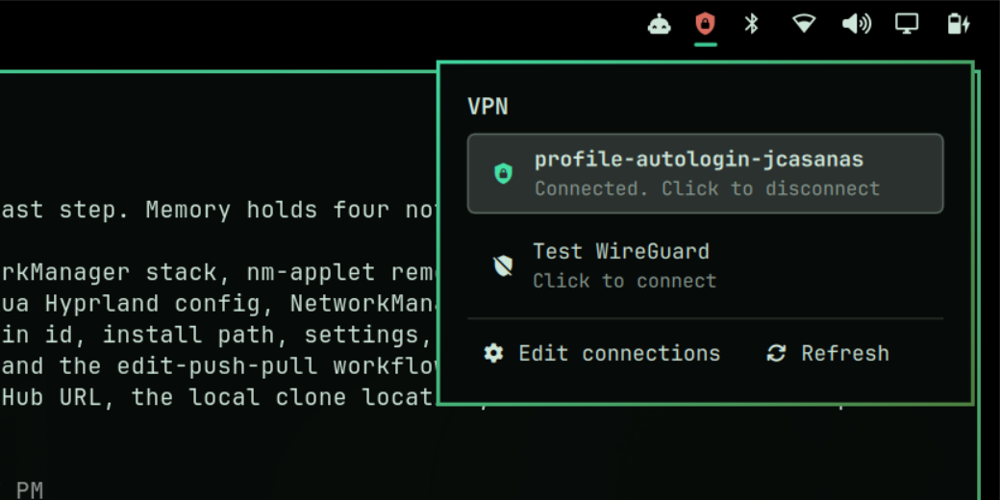

# Omarchy VPN Widget

A native [Omarchy](https://omarchy.org) shell plugin that puts a VPN toggle in
the status bar. It shows whether a NetworkManager VPN is up and connects or
disconnects it with one click. Works with OpenVPN and WireGuard profiles
managed by NetworkManager.

| Off | Connected |
|-----|-----------|
|  |  |

Right-click opens a picker that lists every VPN profile NetworkManager knows
about. Click one to connect it (switching from whatever is active), or click
the connected one to disconnect.



| Icon | Meaning |
|------|---------|
| 󰦞 shield, crossed out | No VPN connected |
| 󰦟 shield outline | VPN is connecting |
| 󰦝 shield with lock, accent color | VPN connected |

| Action | Result |
|--------|--------|
| Left-click | Connect the VPN, or disconnect if one is already up |
| Right-click | Open the profile picker |
| Middle-click | Refresh the status immediately |
| Picker > Edit connections | Open `nm-connection-editor` to import or edit VPN profiles |
| Hover | Tooltip with the profile name and current state |
| Super+Shift+V | Toggle the VPN (added by the installer) |

A desktop notification confirms every connect and disconnect, including
failures.

## Why

Omarchy's built-in network panel only handles Wi-Fi, and its bar has no VPN
control. NetworkManager already knows how to run OpenVPN and WireGuard, so
this plugin is a small Quickshell widget plus two shell scripts. No extra
daemons, no tray applet.

## Requirements

- Omarchy 4.x with the Quickshell-based shell. Tested on 4.0.2.
- NetworkManager with the plugin for your VPN type:
  - OpenVPN: `sudo pacman -S openvpn networkmanager-openvpn`
  - WireGuard: built into NetworkManager, nothing extra to install
- `nm-connection-editor` for the right-click editor (optional but
  recommended): `sudo pacman -S nm-connection-editor`

## Install

Omarchy installs shell plugins straight from git:

```bash
omarchy plugin add https://github.com/juancasa/omarchy_vpn_widget.git --enable
```

That clones the repo into `~/.config/omarchy/plugins/juancasa.vpn`, validates
the manifest, and places the widget in the right section of the bar. Omarchy
asks for confirmation first because plugins run unsandboxed inside the shell.
Add `--yes` to skip the prompts.

To get the Super+Shift+V keybinding as well, run the installer from a clone
instead. It calls the same `omarchy plugin add` and then appends the binding
to `~/.config/hypr/bindings.lua` (backed up first):

```bash
git clone https://github.com/juancasa/omarchy_vpn_widget.git
cd omarchy_vpn_widget
./install.sh
```

Installer options:

```bash
./install.sh --no-keybinding          # plugin only, no keyboard shortcut
./install.sh --key "SUPER + ALT + V"  # use a different key combination
```

Running `install.sh` again updates an existing install instead of failing.

## Add a VPN profile

The widget toggles whatever VPN profiles NetworkManager has. Import one first.

**OpenVPN, from a terminal:**

```bash
nmcli connection import type openvpn file /path/to/your.ovpn
```

If the `.ovpn` references separate certificate or key files, keep them next to
it when importing. If your VPN needs a username, set it once:

```bash
nmcli connection modify "<connection name>" vpn.user-name "<username>"
```

**WireGuard, from a terminal:**

```bash
nmcli connection import type wireguard file /path/to/wg0.conf
```

**From the GUI:** right-click the widget, choose **Edit connections**, press
**+**, choose **Import a saved VPN configuration…** at the bottom of the list,
and pick the file.

Check what NetworkManager knows about with:

```bash
nmcli connection show
```

## Use

- **Connect / disconnect:** left-click the shield, or press Super+Shift+V.
- **Several profiles:** right-click the shield and pick one from the list.
  The left-click toggle connects the first VPN profile in `nmcli`'s order
  unless the `profile` setting names another (see below).
- **Move the widget:** drag it along the bar, or run
  `omarchy bar move juancasa.vpn --section center`.
- **Scripting:** the widget registers an IPC target, so other tools can drive
  it:

  ```bash
  omarchy-shell juancasa.vpn toggle              # connect or disconnect
  omarchy-shell juancasa.vpn connect "Work VPN"  # connect a specific profile
  omarchy-shell juancasa.vpn disconnect
  omarchy-shell juancasa.vpn menu                # open or close the picker
  omarchy-shell juancasa.vpn refresh             # re-read the status now
  omarchy-shell juancasa.vpn editor              # open the connection editor
  ```

  The toggle script also works on its own, for keybindings or cron:

  ```bash
  ~/.config/omarchy/plugins/juancasa.vpn/scripts/vpn-toggle              # toggle
  ~/.config/omarchy/plugins/juancasa.vpn/scripts/vpn-toggle "Work VPN"   # toggle, preferring a profile
  ~/.config/omarchy/plugins/juancasa.vpn/scripts/vpn-toggle --connect "Work VPN"
  ~/.config/omarchy/plugins/juancasa.vpn/scripts/vpn-toggle --disconnect
  ```

## Settings

Settings are stored on the widget's entry in `~/.config/omarchy/shell.json`
and can be changed with `omarchy bar set` or from the shell's Setup panel.

| Key | Default | Purpose |
|-----|---------|---------|
| `interval` | `3` | Seconds between status refreshes |
| `profile` | `""` | Connection name to connect when several VPN profiles exist. Empty uses the first one. |
| `editor` | `nm-connection-editor` | Command behind the picker's "Edit connections" button |
| `notify` | `true` | Send a desktop notification after each connect or disconnect |

Examples:

```bash
omarchy bar set juancasa.vpn profile "Work VPN"
omarchy bar set juancasa.vpn interval 5
omarchy bar set juancasa.vpn notify false --json
```

Changes apply immediately. The plugin's files hot-reload too, so editing the
icons at the top of `scripts/vpn-status` takes effect on the next refresh.

## Update

```bash
omarchy plugin update juancasa.vpn
```

## Uninstall

```bash
omarchy plugin remove juancasa.vpn
```

Or, from a clone, `./uninstall.sh` removes the plugin and the keybinding the
installer added. NetworkManager VPN profiles are untouched either way.

## How it works

```
manifest.json        plugin manifest (id juancasa.vpn, kind bar-widget)
Widget.qml           the bar widget: polls the status script, handles clicks, hosts the picker popup
scripts/vpn-status   prints {"text","tooltip","class","profiles"} from nmcli state
scripts/vpn-toggle   nmcli connection up / down with notifications
```

The widget runs `vpn-status` on a timer and reads its JSON. When `class` is
`active` the icon is drawn in the bar's accent color. Clicks run `vpn-toggle`,
passing the preferred profile from settings.

## Troubleshooting

- **Icon missing:** check the plugin is enabled with `omarchy plugin list`,
  then run the status script by hand:
  `~/.config/omarchy/plugins/juancasa.vpn/scripts/vpn-status`. Shell log:
  `journalctl --user -b | grep juancasa.vpn`.
- **"No VPN profiles" tooltip:** import a profile (see above). The widget only
  lists connections whose type is `vpn` or `wireguard`.
- **Connect fails:** run `nmcli connection up "<name>"` in a terminal to see
  the real error. Missing certificates and wrong credentials are the usual
  causes.
- **Validate a local checkout:** `omarchy plugin validate .`

## License

MIT, see [LICENSE](LICENSE).
